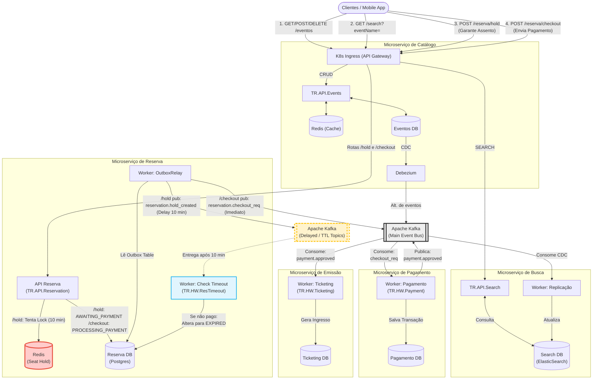
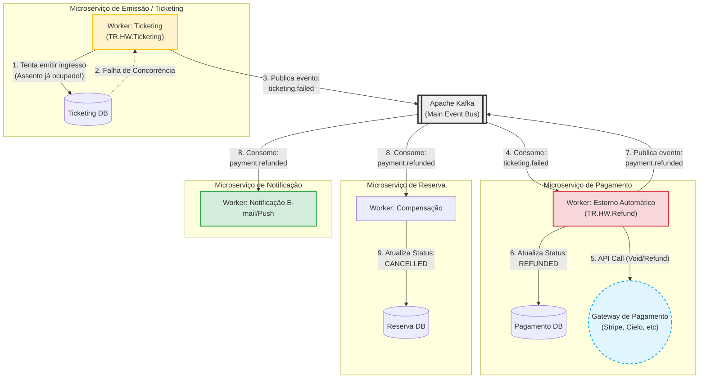

# Architectural Decisions

## Diagrama

```mermaid
flowchart TB
    %% ================= CLIENTES & GATEWAY =================
    Client(["Clientes / Mobile App"])

    Client -- "1. GET/POST/DELETE /eventos" --> Ingress["K8s Ingress (API Gateway)"]
    Client -- "2. GET /search?eventName=" --> Ingress
    Client -- "3. POST /reserva/hold \n(Garante Assento)" --> Ingress
    Client -- "4. POST /reserva/checkout \n(Envia Pagamento)" --> Ingress

    %% ================= DOMÍNIO DE EVENTOS & BUSCA =================
    subgraph SVC_EVENTOS [Microserviço de Catálogo]
        Ingress -- "CRUD" --> API_Eventos["TR.API.Events"]
        API_Eventos <--> RedisCache[("Redis (Cache)")]
        API_Eventos <--> EventosDB[("Eventos DB")]
        EventosDB -- "CDC" --> Debezium["Debezium"]
    end

    subgraph SVC_BUSCA [Microserviço de Busca]
        Ingress -- "SEARCH" --> API_Search["TR.API.Search"]
        API_Search <-- "Consulta" --> SearchDB[("Search DB \n(ElasticSearch)")]
        HWRepl["Worker: Replicação"] -- "Atualiza" --> SearchDB
    end

    %% ================= MENSAGERIA CENTRAL =================
    Kafka[["Apache Kafka \n(Main Event Bus)"]]
    Kafka_Delayed[["Apache Kafka \n(Delayed / TTL Topics)"]]

    Debezium -- "Alt. de eventos" --> Kafka
    Kafka -- "Consome CDC" --> HWRepl

    %% ================= DOMÍNIO DE RESERVAS =================
    subgraph SVC_RESERVA [Microserviço de Reserva]
        API_Reserva["API Reserva \n(TR.API.Reservation)"]
        Ingress -- "Rotas /hold e /checkout" --> API_Reserva

        %% Hold no Redis
        API_Reserva -- "/hold: Tenta Lock (10 min)" --> RedisHold[("Redis \n(Seat Hold)")]

        %% Persistência DB e Outbox
        API_Reserva -- "/hold: AWAITING_PAYMENT \n/checkout: PROCESSING_PAYMENT" --> DB_Res[("Reserva DB \n(Postgres)")]
        Outbox_Relay["Worker: OutboxRelay"] -- "Lê Outbox Table" --> DB_Res

        %% Worker de Reconciliação (O novo componente)
        Worker_Timeout["Worker: Check Timeout \n(TR.HW.ResTimeout)"]
        Worker_Timeout -- "Se não pago: \nAltera para EXPIRED" --> DB_Res
    end

    %% Roteamento do Outbox
    Outbox_Relay -- "/hold pub: reservation.hold_created \n(Delay 10 min)" --> Kafka_Delayed
    Outbox_Relay -- "/checkout pub: reservation.checkout_req \n(Imediato)" --> Kafka

    %% Consumo do Timeout
    Kafka_Delayed -. "Entrega após 10 min" .-> Worker_Timeout

    %% ================= DOMÍNIO DE PAGAMENTOS =================
    subgraph SVC_PAGAMENTO [Microserviço de Pagamento]
        Worker_Pag["Worker: Pagamento \n(TR.HW.Payment)"] -- "Salva Transação" --> DB_Pag[("Pagamento DB")]
    end
    Kafka -- "Consome: \ncheckout_req" --> Worker_Pag
    Worker_Pag -- "Publica: \npayment.approved" --> Kafka

    %% ================= DOMÍNIO DE TICKETING (EMISSÃO) =================
    subgraph SVC_TICKETING [Microserviço de Emissão]
        Worker_Ticket["Worker: Ticketing \n(TR.HW.Ticketing)"] -- "Gera Ingresso" --> DB_Tick[("Ticketing DB")]
    end
    Kafka -- "Consome: \npayment.approved" --> Worker_Ticket

    %% ================= OBSERVABILIDADE (Omitida p/ Clareza) =================
    %% OTel Collector continua monitorando todos os Workers e APIs.

    %% ================= ESTILIZAÇÃO =================
    style Kafka fill:#eee,stroke:#333,stroke-width:3px
    style Kafka_Delayed fill:#fff3cd,stroke:#ffc107,stroke-width:3px,stroke-dasharray: 5 5
    style RedisHold fill:#ffcccb,stroke:#e74c3c,stroke-width:3px
    style Worker_Timeout fill:#e1f5fe,stroke:#03a9f4,stroke-width:2px
```

---

```mermaid
flowchart TB
    %% ================= DOMÍNIO DE TICKETING (FALHA) =================
    subgraph SVC_TICKETING [Microserviço de Emissão / Ticketing]
        Worker_Ticket["Worker: Ticketing \n(TR.HW.Ticketing)"]
        DB_Tick[("Ticketing DB")]

        %% Tentativa de gravação falha (Assento indisponível)
        Worker_Ticket -- "1. Tenta emitir ingresso \n(Assento já ocupado!)" --> DB_Tick
        DB_Tick -. "2. Falha de Concorrência" .-> Worker_Ticket
    end

    %% ================= MENSAGERIA CENTRAL =================
    Kafka[["Apache Kafka \n(Main Event Bus)"]]

    %% O Worker de Ticketing avisa que deu ruim
    Worker_Ticket -- "3. Publica evento: \nticketing.failed" --> Kafka

    %% ================= DOMÍNIO DE PAGAMENTOS (ESTORNO) =================
    subgraph SVC_PAGAMENTO [Microserviço de Pagamento]
        DB_Pag[("Pagamento DB")]

        %% NOVO: Worker Dedicado a Estornos
        Worker_Estorno["Worker: Estorno Automático \n(TR.HW.Refund)"]

        %% Integração Externa
        Worker_Estorno -- "5. API Call (Void/Refund)" --> Gateway_Ext(("Gateway de Pagamento \n(Stripe, Cielo, etc)"))

        %% Atualização de Estado
        Worker_Estorno -- "6. Atualiza Status: \nREFUNDED" --> DB_Pag
    end

    Kafka -- "4. Consome: \nticketing.failed" --> Worker_Estorno
    Worker_Estorno -- "7. Publica evento: \npayment.refunded" --> Kafka

    %% ================= DOMÍNIO DE RESERVAS E NOTIFICAÇÃO =================
    subgraph SVC_RESERVA [Microserviço de Reserva]
        Worker_Compensacao["Worker: Compensação"]
        DB_Res[("Reserva DB")]
        Worker_Compensacao -- "9. Atualiza Status: \nCANCELLED" --> DB_Res
    end

    subgraph SVC_NOTIFICACAO [Microserviço de Notificação]
        Worker_Notif["Worker: Notificação E-mail/Push"]
    end

    %% Concluindo a Saga
    Kafka -- "8. Consome: \npayment.refunded" --> Worker_Compensacao
    Kafka -- "8. Consome: \npayment.refunded" --> Worker_Notif

    %% ================= ESTILIZAÇÃO =================
    style Kafka fill:#eee,stroke:#333,stroke-width:3px
    style Worker_Ticket fill:#fff3cd,stroke:#ffc107,stroke-width:2px
    style Worker_Estorno fill:#f8d7da,stroke:#dc3545,stroke-width:2px
    style Gateway_Ext fill:#e1f5fe,stroke:#03a9f4,stroke-width:2px,stroke-dasharray: 5 5
    style Worker_Notif fill:#d4edda,stroke:#28a745,stroke-width:2px
```