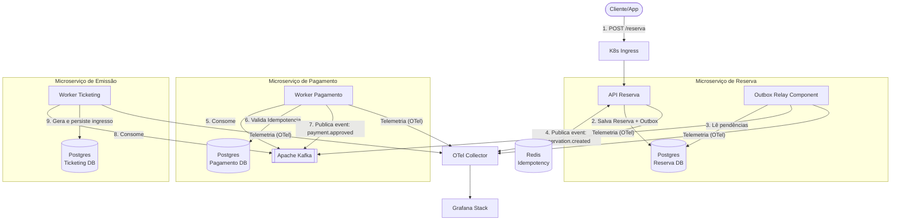

# Architectural Decision Records (01-arch-decisions.md)

## ADR 01: Separação do Componente Outbox Relay
*   **Status:** Aprovado.
*   **Contexto:** APIs de alta concorrência sofrem gargalos quando concorrem por CPU e conexões de banco com Background Jobs de infraestrutura rodando no mesmo processo.
*   **Decisão:** O processamento da tabela de Outbox será extraído para um console application .NET isolado (`Outbox-Relay`), empacotado em um container Docker independente e escalado de forma autônoma no Kubernetes.
*   **Consequências:** Isolamento de falhas (se o Kafka cair, a API de Reserva continua vendendo ingressos normalmente no banco) e escalabilidade independente (o Relay pode ser tunado com mais instâncias se o lag do Kafka subir).

## ADR 02: Estratégia Híbrida de Idempotência
*   **Status:** Aprovado.
*   **Contexto:** Proteger o sistema contra requisições duplicadas na borda e garantir a integridade financeira no processamento de pagamentos em segundo plano.
*   **Decisão:**
    *   **Borda (API Reserva):** Camada de cache distribuído em Redis com TTL de 24 horas usando o comando atômico `SET NX`.
    *   **Núcleo (Worker Pagamento):** Constraint de chave única (`UNIQUE INDEX`) no Postgres baseada no `ReservationId`.
*   **Consequências:** A API responde rápido sem onerar o banco relacional. O Worker de pagamento garante atomicidade transacional máxima (ACID), eliminando qualquer risco de inconsistência financeira.

## ADR 03: SAGA baseada em Coreografia
*   **Status:** Aprovado.
*   **Contexto:** Necessidade de coordenar o fluxo distribuído entre Reserva, Pagamento e Emissão de Ingressos sem criar um ponto único de falha (Orquestrador centralizado).
*   **Decisão:** Cada microsserviço reagirá autonomamente a eventos específicos no Apache Kafka. O rollback de estado será feito via publicação de eventos de compensação (ex: `PaymentRefusedEvent`).
*   **Consequências:** Sistema altamente desacoplado, porém exige monitoramento visual rigoroso via OpenTelemetry para depurar fluxos de transação complexos.

## Diagrama

